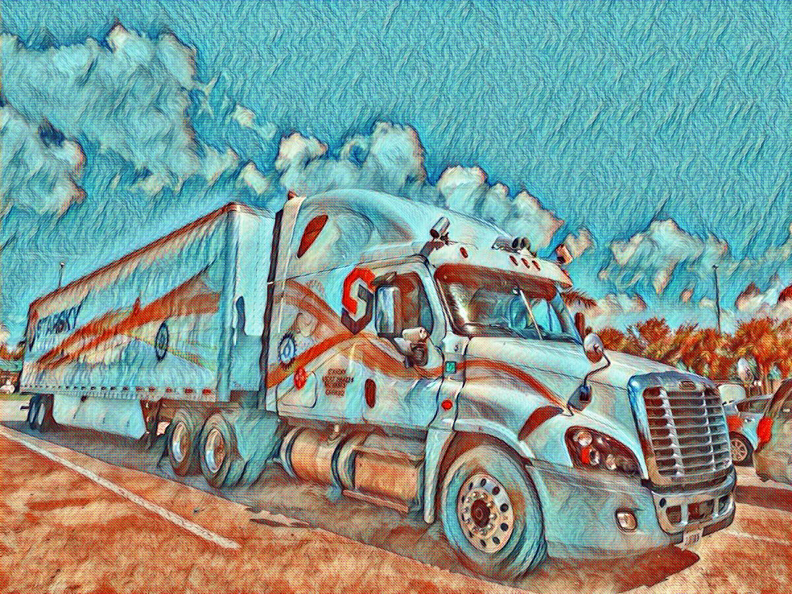

StarskyKnights
==============

I would have completed parts 4 and 5 if I didn't have to manually identify and write down the coordinates of all the non-standard 
tiles.

Features:
* Implements Chebyshev distance to rank moves. (I called it "chessDistance" because "chebyshevDistance" has too many characters.)
* Relaxes the movement constrains in order to bound search space. I.e. I have a "relaxed" horse that can move anywhere within 2 squares to identify best case remaining moves. 
* In Scala. You are welcome.
* Almost purely functional.
* There is a testing suite that validates the code. This fulfills the "use the validator" instructions in part 4.
* Pretty sure it finds an optimal solution.

